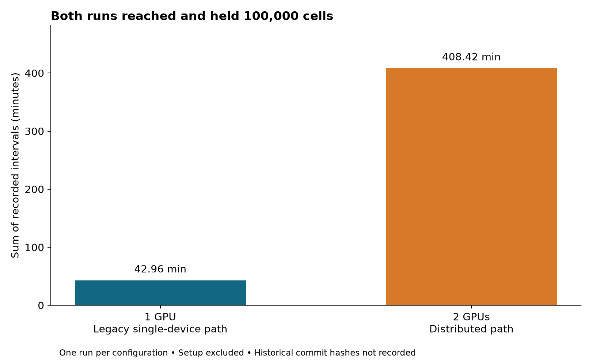
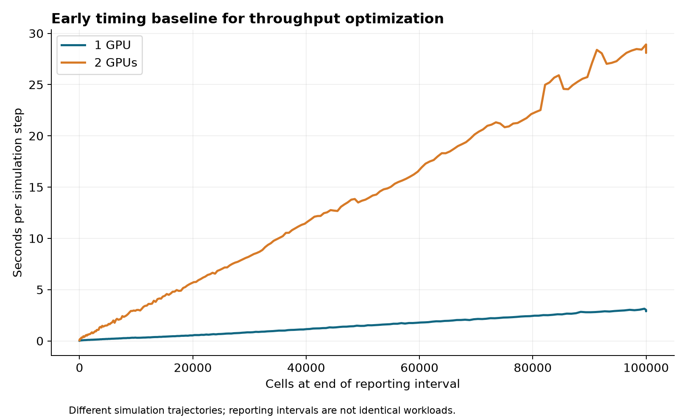

# CellModeller Multi-GPU — Reproducibility Package

This package records work in progress on distributed CellModeller simulations inside **AxonDAO-hosted AxonOS**, available at [app.axonos.io](https://app.axonos.io). It contains the evidence behind a successful two-device execution test and its single-device comparison, plus the status of a later four-device GUI experiment.

**Result:** both recorded headless runs reached and held **100,000 cells**. The two-GPU run took **408.42 minutes**, versus **42.96 minutes** for the single-GPU run: **9.51× slower** in these observations. This establishes distributed execution at the tested population, not acceleration, numerical equivalence, a new biological finding, or maximum capacity. There is one run per configuration; historical commit hashes and complete environments were not captured.

## Package layout

```text
config/benchmark.json       Parameters, provenance gaps, telemetry cutoffs
scripts/                   Reanalysis, figures, future benchmark capture
metrics/                   Original JSONL logs and derived comparison/intervals
telemetry/                 Original device-wide CSV recordings, including idle tails
results/figures/           Regenerated runtime and population/timing plots
data/manifest.json         Source hashes and four-GPU observation provenance
environment.lock.txt       Partial observed environment, NOT a complete lock
MANIFEST.md, MANIFEST.sha256  Package integrity inventory
```

## Recorded results (source of truth)

| Measure | One GPU | Two GPUs |
|---|---:|---:|
| Hardware | 1 × V100-SXM2-32GB | 2 × V100-SXM2-32GB |
| End status | target_held | target_held |
| Final cells | 100,000 | 100,000 |
| Final step | 2,454 | 2,459 |
| Sum of reporting intervals | 2,577.79 s | 24,505.43 s |
| Seconds/step, intervals ending at 100,000 cells | 2.930 | 28.602 |

Timing excludes initialization. The last row includes the first reporting interval that reaches the target, and is not an isolated measurement of exactly 100 fixed-population steps. Population trajectories differ slightly. See [machine-readable results](metrics/comparison.json) and [raw logs](metrics/).

Two-device `physics.find_contacts` counters total 338,521,954 and 338,513,569 work items, respectively. This shows a nearly equal count of scheduled work items; it does **not** establish equal computation time, simultaneous execution, or equal utilization.




**Four-GPU GUI observation, 5 October 2026:** four V100 devices were selected with 25% configured shares. Startup printed a target of **2,587,976 cells** and 10,351,904 spatial bins. A later screenshot shows **9,567 cells** at step 360, with resident-CG output. The target is a memory estimate, not an achieved population or guaranteed limit. Original screenshots are retained in the separate internal marketing evidence folder; this package transcribes the observations and hashes their sources. There is no four-GPU completion log here.

## Environment and runtime

Runs were performed in a hosted AxonOS desktop. The [AxonOS repository](https://github.com/AXDT-INC/AxonOS) documents the platform. CellModeller was installed in `/opt/CellModeller` using an editable Python installation. NVIDIA driver 580.173.02 is recorded in the JSONL logs.

The one-device run exercises the legacy single-device path **within the multigpu branch**, not an independently tested master checkout. Its `partitioned` command-line argument does not turn it into the distributed solver. The historical exact commits are unknown. Commit `d4136ebe347fe20bdcf5c37fb0f786fa714f58ee` is a reference for future repetitions, not a claim about the old logs. Confirm that your configured remote actually contains this branch and commit.

`environment.lock.txt` deliberately identifies missing versions. This package supports reanalysis and a documented repetition protocol; it does not promise an exact historical environment reconstruction.

## Model and data acquisition

No external biological dataset is needed. Use the CellModeller checkout containing `Examples/multigpu_stress.py` and `Examples/multigpu_stress_gui.py`. The synthetic colony begins with one founder. The headless test uses four species, seed 12345, dt 0.025, growth rate 2.0 and a 100,000-cell target. The GUI model is a different workload and must not be compared directly as an identical benchmark.

## Commands

### Pre-flight and branch switch

Save any local modifications before switching. Inspect the remote; `origin` must contain the experimental branch.

In the reported AxonOS installation, switching the `/opt/CellModeller` checkout without `sudo` returned permission denied. The commands below use `sudo` for Git operations that modify this protected checkout. On a user-writable checkout, omit `sudo`. Run Python import checks, simulations and the GUI as the regular user; this checkout permission issue does not require launching the GUI as root.

```bash
cd /opt/CellModeller
git status --short
git remote -v
sudo git fetch origin
sudo git switch multigpu
# If no local branch exists: sudo git switch --track origin/multigpu
sudo git pull --ff-only origin multigpu
git rev-parse HEAD
python - <<'PYCODE'
import inspect, importlib, sys
sys.path[0] = '/opt/CellModeller/Scripts'
from CellModeller.Simulator import Simulator
viewer = importlib.import_module('CellModeller.GUI.PyGLCMViewer')
print('Python:', sys.executable)
print('Simulator:', inspect.getfile(Simulator))
print('GUI:', viewer.__file__)
params = inspect.signature(Simulator.__init__).parameters
print('Multi-GPU support:', 'clDeviceNums' in params)
print('Partitioned-memory support:', 'clMultiGPUMemory' in params)
PYCODE
```

For an existing editable install, switching the source branch generally needs no reinstall when dependencies and packaging have not changed. Verify imports; an unrelated pip permission failure is not proof the GUI loads old code. Restart the GUI after switching. To pin a future study, select the reference commit in a separate checkout and record it. Keep source and environment unchanged between comparison runs.

### GUI trial

```bash
cd /opt/CellModeller
python Scripts/CellModellerGUI.py
```

Choose **Load Model → Examples/multigpu_stress_gui.py**, select the intended GPUs, leave weights blank for equal shares, and select partitioned memory. Record startup output and its capacity estimate. GUI growth stops at its target, but the GUI is not a timed automatic-exit benchmark. More devices do not guarantee faster execution or a fully usable sum of their VRAM.

### Matched headless repetitions

From this experiment directory, run sequentially with no competing simulation:

```bash
bash scripts/run_benchmark.sh /opt/CellModeller 0 "$HOME/cm-one-gpu-repeat"
bash scripts/run_benchmark.sh /opt/CellModeller 0,1 "$HOME/cm-two-gpu-repeat"
```

The script refuses existing output directories, captures provenance, and stops telemetry when the run exits. Inspect `git-status.txt`; a dirty tree weakens reproducibility. These commands are for future hardware testing and were not executed while assembling this package.

### Reanalyze recorded evidence and regenerate figures

```bash
python scripts/analyze.py
# Requires matplotlib in the chosen Python environment:
python scripts/make_figures.py
sha256sum -c MANIFEST.sha256
```

Raw file checksums remain stable. Plot regeneration can change image checksums across matplotlib versions; verify the supplied package before regeneration. No GPU is required for reanalysis.

## Telemetry methodology

Original CSVs sample device-wide utilization, memory and power, roughly once per second. They include many hours of idle time after simulation completion. `config/benchmark.json` specifies approximate exclusive end cutoffs inferred from memory release, with the first sample as the window start. There are no synchronized timestamps in the simulation logs, so these are approximate windows, not exact process-isolated traces.

Within these windows, mean GPU utilization is approximately 3.82% on GPU 0 in the single run, and 6.74% / 4.09% on GPUs 0 / 1 in the two-device run. Desktop activity can contribute. Utilization percentages and work-item counters are not throughput measurements. Retain the full raw CSVs for audit and do not average their idle tails into a workload claim.

## Expected stochastic variability

Fixed seeds do not guarantee identical floating-point reduction order or division trajectories across device counts. No repeated-run confidence intervals, numerical-equivalence tolerances, or biological validation are supplied. Compare population, contacts, convergence and physical observables under a controlled validation protocol before scientific production claims.

## Multi-GPU engineering provenance

CellModeller already provided GPU-accelerated simulation. The baseline workflow selects one OpenCL device per simulation. The experimental branch adds device selection, weighted work distribution and partitioned storage, followed by a resident iterative solver. Keeping solver state on devices does not eliminate host work, exchange, synchronization or rendering across the full application. The measured slowdown makes stage-level profiling the next engineering priority.

Partitioning addresses the need for every GPU to hold a complete copy of relevant distributed arrays. It is not transparent pooled VRAM: host memory, halo/global data, allocation limits, interactions and implementation details remain constraints. Neither 100,000 nor 2,587,976 is a universal CellModeller limit.

## Reproducibility of this package

Analysis scripts derive the published timing and utilization summaries from unmodified source logs. `data/manifest.json` records original filenames and SHA-256 hashes. Manifests cover package files except themselves. Historical run provenance gaps are explicit; this is an evidence and repetition package, not a certified performance benchmark.

## What is intentionally excluded

Full container images, complete historical dependency locks, simulation checkpoint outputs, stage-level GPU profiles and four-GPU completion logs were not available. Screenshots containing account/browser details are retained only in the internal handoff. The earlier partial two-GPU telemetry file is omitted in favor of the longer September 15 recording. No speedup or maximum-capacity result is implied.

## License / attribution

CellModeller and its scientific foundations belong to their original authors. This package does not relicense upstream software. Consult the upstream repository license when reusing code. AxonDAO provided the hosted AxonOS environment and this experimental engineering/reporting workflow.

- Rudge TJ, Steiner PJ, Phillips A, Haseloff J. **Computational Modeling of Synthetic Microbial Biofilms.** ACS Synthetic Biology. 2012;1(8):345–352. [DOI:10.1021/sb300031n](https://doi.org/10.1021/sb300031n).
- Rudge TJ, Federici F, Steiner PJ, Kan A, Haseloff J. **Cell Polarity-Driven Instability Generates Self-Organized, Fractal Patterning of Cell Layers.** ACS Synthetic Biology. 2013;2(12):705–714. [DOI:10.1021/sb400030p](https://doi.org/10.1021/sb400030p).
- [CellModeller upstream](https://github.com/cellmodeller/CellModeller), [AxonOS](https://github.com/AXDT-INC/AxonOS), [AxonOS Experiments](https://github.com/AXDT-INC/AxonOS-Experiments).

Prepared 5 October 2026. This local package has not been published or submitted upstream.
